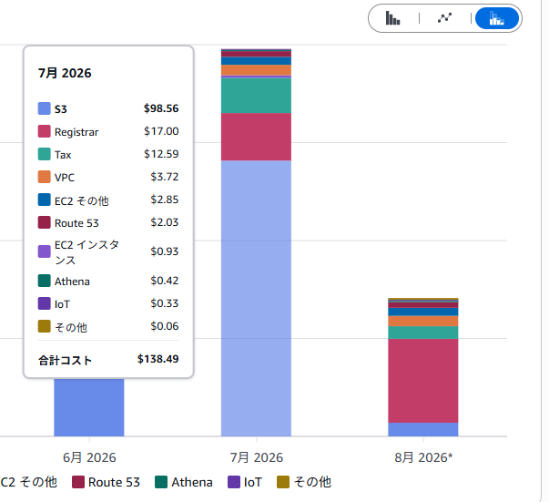
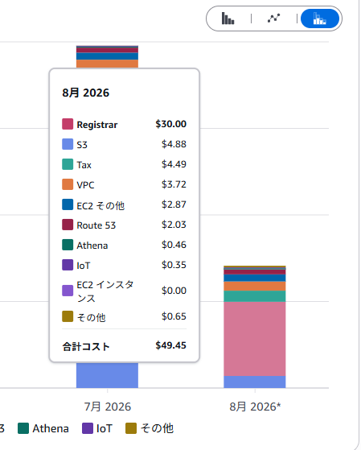

# S3 の小さい JSON を毎時まとめたら、月額が $98 → $5 になった話

## 言いたいこと

IoT デバイス群の計測値を AWS IoT Core 経由で S3 に貯め、Athena + Grafana で眺めるシステムを運用しています。デバイス → IoT Core → Lambda（`ingest`）→ S3、という受信経路だけ押さえておけば、この記事は単体で読めます。

その S3 の月額が、ある対策だけで**だいたい $98 → $5 まで落ちました**。

この記事で言いたいのは次です。

- 犯人は「小さい JSON ファイルを Athena 経由で高頻度に読ませていたこと」
- 対策は地味で、**1 時間分をまとめて 1 ファイルにする Lambda を毎時走らせただけ**
- 一度、実装をバックフィル都合でこじらせて、あとから戻した話も添えます

---

## 何が起きていたか

デバイスは `sensors/{device_id}/data_bin` に publish し、Topic Rule 経由の Lambda（`ingest`）が S3 の `raw/year=.../month=.../day=.../hour=.../` 配下に、**メッセージ1件＝1オブジェクト**として書き込みます。

一方 Grafana は Athena 経由でこのテーブルを、直近24hをデフォルト表示にしたダッシュボードで **15分おき**にクエリしています。稼働台数・稼働時間が伸びるほど、1 hour パーティションあたり平均約29個の小さいファイルが溜まり、そのすべてを毎回開くことになります。

パーティションを条件に絞っても、**パーティション「内」のオブジェクト数分の GET/LIST は減らせません**。これが S3 のリクエスト課金（Tier1/Tier2）としてじわじわ効いていました。

---

## やったこと：1時間ごとに1ファイルへまとめる Lambda

対策はシンプルです。EventBridge Scheduler で毎時起動する Lambda（`iot-monitor-compact`）を追加し、確定済みの hour パーティション（現在進行中の hour と直前1時間は ingest とのレース回避で除外）を対象に、複数の小ファイルを1つの NDJSON（`merged.json`）へまとめます。

ポイントは2つです。

- **テーブル定義・Grafana のクエリは無改修**。Glue のテーブルがもともと `TextInputFormat` + `JsonSerDe`（改行区切り JSON を複数行読める）＋ partition projection だったので、NDJSON にまとめるだけで済みました
- **冪等**。`merged.json` があればそこへ追記、なければ小ファイルが2件以上のときだけ新規作成（1件だけなら圧縮する意味がないのでスキップ）。オフラインバッファ経由で後から古い hour に書き込まれても、次回実行時に自然に吸収されます

```python
if not stragglers:
    return skip
if not has_merged and len(stragglers) < 2:
    return skip  # 1件だけなら圧縮の意味がない
# stragglers を読み、既存の merged.json があれば追記して上書き
```

元の小ファイルは即削除ではなく、アーカイブ用バケットへ `copy_object` してから `delete_object` します。90日で S3 Lifecycle により自動で消えるので、コピーや削除が一度失敗しても実害はほぼありません（次回また拾われるだけです）。

---

## 一度こじらせて、あとで戻した話（余談）

最初の実装は素直な逐次処理でした。ただ過去データ約105,000件のバックフィルを速く終わらせたくて、パーティション単位の並列化・バッチ処理・ワイドスレッドプール化と、段々複雑にしていきました。

バックフィルが完走した時点で我に返りました。**普段は1時間に1パーティションを merge するだけの処理**なのに、コードだけバックフィル仕様のまま残るのは割に合いません。並列化・バッチ処理まわりを `git revert` で戻し、`ThreadPoolExecutor` も手で完全に除去して、最初のシンプルな逐次処理に戻しました。

同時実行レース対策の `reserved_concurrent_executions=1` だけは、コードの単純さと無関係な安全策（同時実行による行重複防止）なので残しています。バックフィルのような一度きりの都合でコードを恒常的に複雑にしないほうがいい、という当たり前の話を身をもってやりました。

---

## トレードオフ：DELETE の粒度が荒くなる

`DELETE /data` はもともと Athena の `$path`（＝`raw/` 配下の個別オブジェクトキー）を使って **行単位**で削除していました。compaction 後は、削除対象が「行」から「マージ後ファイル全体（＝その時間帯の全行）」に落ちます。

これは現時点で許容しています。将来的に「対象キーがマージ済みファイルなら GetObject → 該当行を除いて PutObject で上書き」という分岐を足せば行単位を維持できますが、今回のスコープ外にしました。**スキャンコストを下げる本題と、削除の精度を維持する話は分けて考える**、という判断です。

---

## 効果

`raw/` 配下のオブジェクト数は 104,688 → 3,126（約97%減）でした。

AWS のコスト内訳を見ても、S3 のコストが月 **$98.56 → $4.88** まで落ちています。





なお8月は Registrar（ドメイン更新）が $30 と単月で目立っていますが、これは compaction とは無関係の年次更新費用です。見るべきは S3 の行だけで、そこは狙いどおり落ちています。

---

## まとめ

やったことは「1時間分の小ファイルを1つの NDJSON にまとめる Lambda を毎時走らせる」だけで、テーブル定義や Grafana 側は一切いじっていません。

Athena は「置いただけ」だと簡単に高くなります。今回わかったのは、原因が Athena のスキャン量そのものではなく **S3 側のオブジェクト数**だったことで、これは実際に数字を並べてみるまで気づきにくいところでした。ダッシュボードが「見える」ようになった瞬間、裏で何個のオブジェクトを開いているかは一度疑ったほうがいいです。
